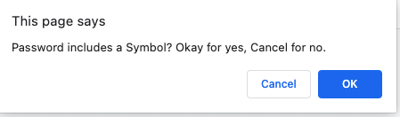

# Password-Generator-with-Javascript

# Description

This project allows the user to generate random passwords based on criteria that they’ve selected in the browser. This project features functioning HTML and CSS pages and is powered by Javascript. 

When loaded in the browser, the user can click the 'Generate Password' icon, which will then load a series of prompts for the user. The user will be able to choose the length of the password and the types of characters involved, including both uppercase and lowercase letters, numbers and symbols. If the initial password length doesn't meet the browser's rules, a prompt will generate asking the user to re-enter a value. Once the user has selected through each prompt, a unique password will generate in the window on the browser. 

This is my first project that features a large portion of javascript functionality and I was very proud of the outcome. Creating a function that would lead to the user with a unique password was very challenging, but was well worth it. 

## Table of Contents
 * [Installation](#Installation) 
 * [Usage](#Usage)
 * [Credits](#Credits)
 * [License](#License)

## Installation

1. visit https://www.tutorialspoint.com/javascript/index.htm

## Usage
*  Main Page

*  Initial Password Prompt

*  Re-Enter Prompt

*  Lowercase Letters

* Uppercase Letters

* Numbers

* Symbols

* Final 

## Credits
1. https://www.tutorialspoint.com/javascript/index.htm
2. https://www.w3schools.com
3. https://www.easyprogramming.net/javascript/js_random_password_generator.php

## License
...